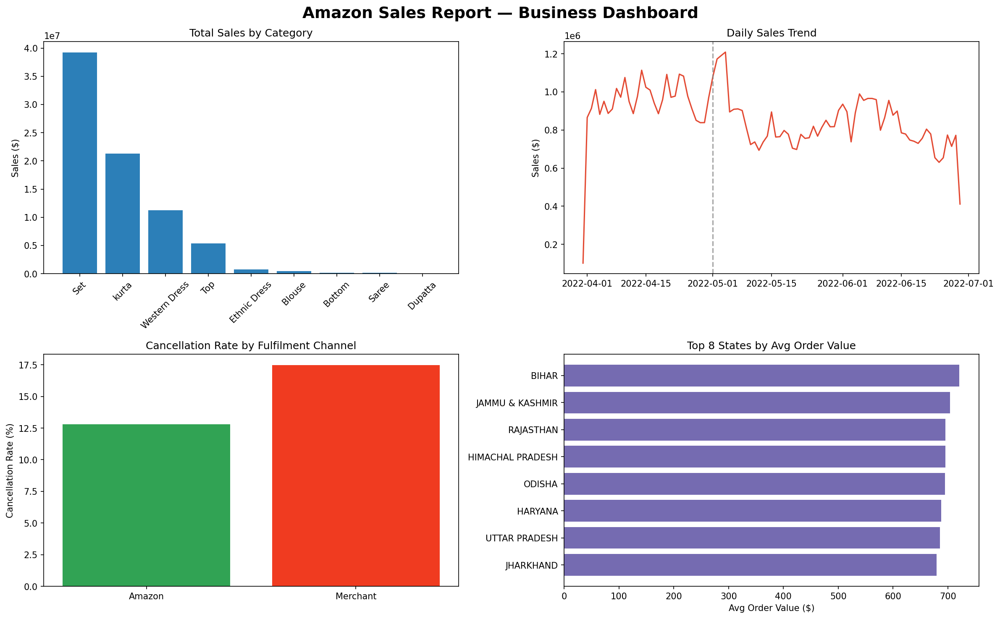

# 📊 Amazon Sales Analysis — E-Commerce Business Insights

**Data Analyst** | AI-Augmented Data Analysis Project

## Overview
End-to-end analysis of 128,942 Amazon marketplace orders (March–June 2022) to uncover revenue drivers, operational issues, and regional sales patterns — with actionable business recommendations, not just descriptive statistics.

## Key Findings
- **Revenue concentration**: "Set" and "kurta" categories drive over 65% of total revenue
- **Consistent cancellation issue**: ~14% cancellation rate across nearly all categories — a store-wide problem, not category-specific
- **Fulfillment gap**: Merchant-fulfilled orders cancel at 17.5% vs. 12.8% for Amazon-fulfilled orders
- **Demand drop**: Daily order volume fell ~16% after May 1st with no recovery — isolated to volume, not price or cancellations
- **Regional behavior**: Smaller markets show 10-15% higher average order values than high-volume states

## Dashboard

## Tools & Approach
- **Python** (pandas, matplotlib, seaborn) for data cleaning and analysis
- **AI used as a coding co-pilot**: writing/debugging code and validating logic — all business questions, interpretation, and recommendations were independently reasoned through by the analyst
- Full methodology and data-cleaning decisions documented in the notebook

## Files
- `amazon_sales_analysis.ipynb` — full analysis notebook with step-by-step code and explanations
- `dashboard.png` — summary visual dashboard
- `Amazon_Sales_Executive_Summary.docx` — one-page business report for stakeholders

## Dataset
[Amazon Sale Report](https://www.kaggle.com/datasets/thedevastator/unlock-profits-with-e-commerce-sales-data) — public e-commerce dataset via Kaggle

---
*This project demonstrates an AI-augmented analytics workflow: AI as an execution assistant, human as strategist and decision-maker.*
